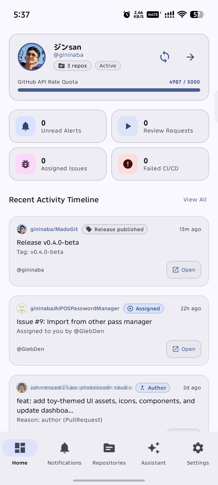
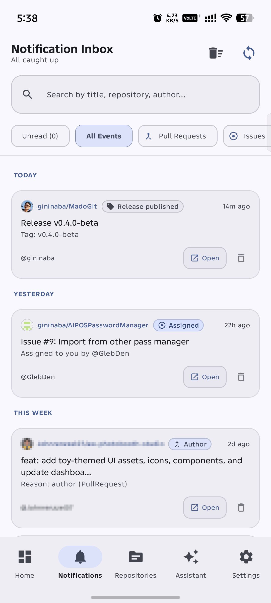
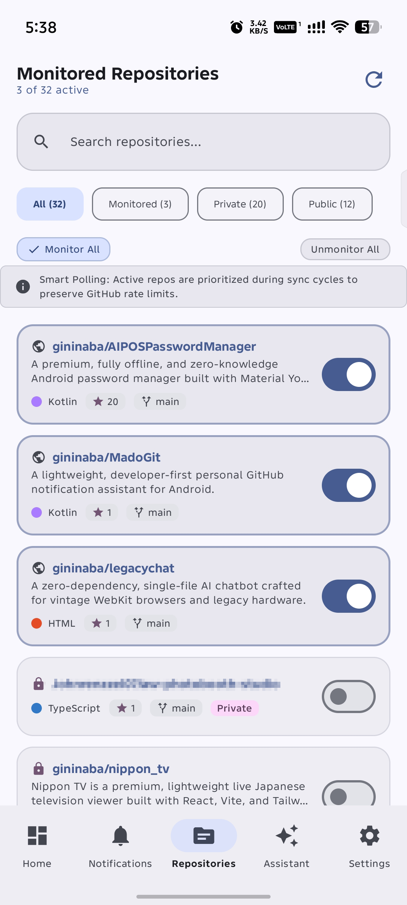
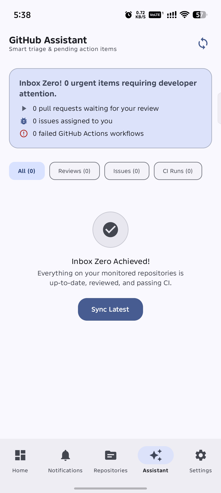
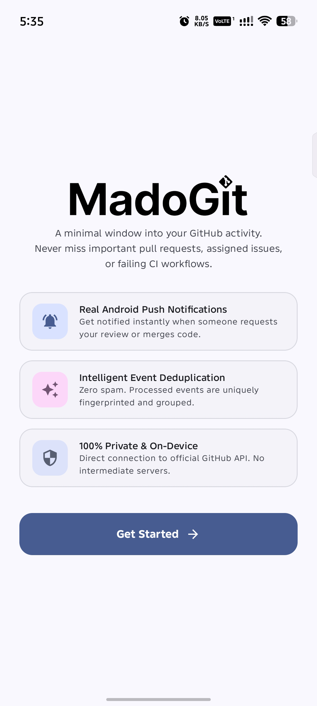
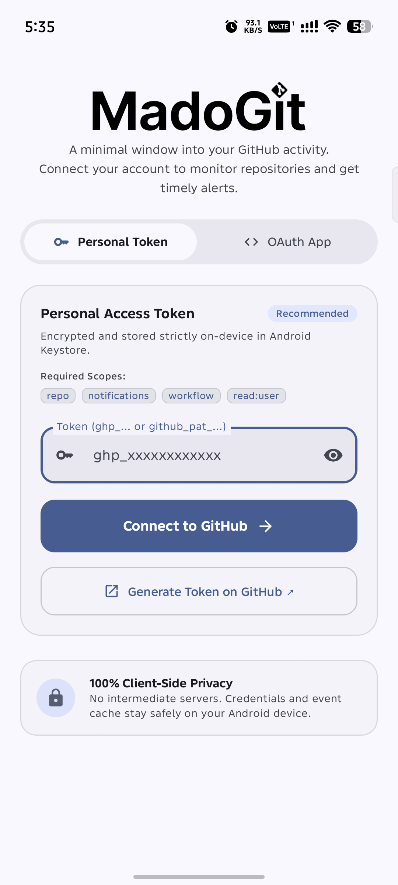
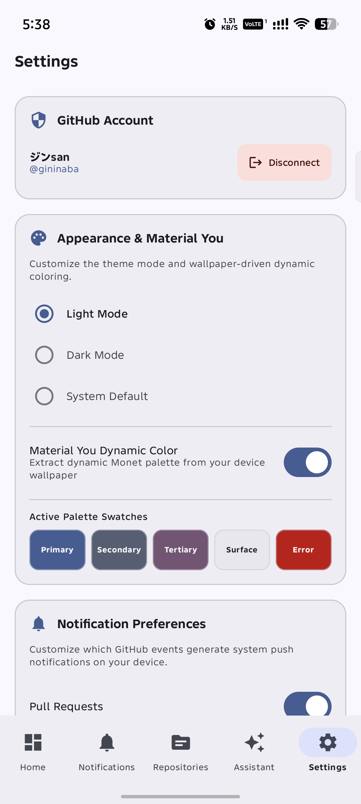
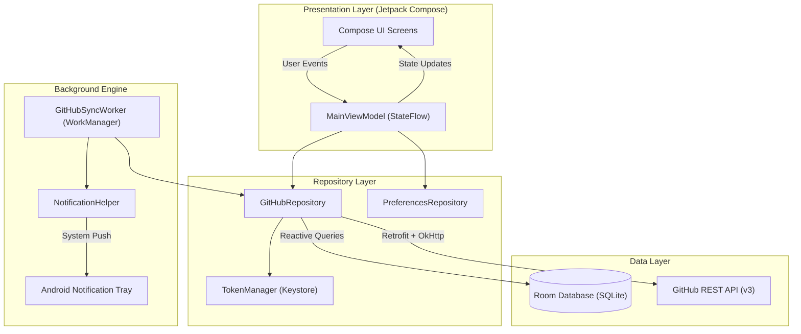

<p align="center">
  
</p>

<h1 align="center">MadoGit</h1>

<p align="center">
  <strong>(Mado = window) — A minimal window into your GitHub activity.</strong>
</p>

<p align="center">
  A lightweight, developer-first personal GitHub notification assistant for Android.
  <br />
  Monitors your repositories, pull requests, issues, and CI workflows with timely Android system push notifications, smart deduplication, and zero intermediate servers.
</p>

<p align="center">
  <a href="RELEASE_NOTES.md"></a>
  
  
  
  
  
  
  <a href="LICENSE"></a>
</p>

> [!IMPORTANT]
> **Project Status: Experimental**
> MadoGit is currently under active, experimental development. Features, database schemas, and UI flows are subject to rapid iteration and refactoring. It is provided for personal testing, developer dogfooding, and community feedback. Contributions, bug reports, and suggestions are welcome.

---

## Table of Contents

- [App Preview & Screenshots](#app-preview--screenshots)
- [1. Overview & Philosophy](#1-overview--philosophy)
- [2. Key Architectural Pillars](#2-key-architectural-pillars)
- [3. Architecture & Data Flow](#3-architecture--data-flow)
- [4. Core Features](#4-core-features)
- [5. Notification System & Channels](#5-notification-system--channels)
- [6. Material You Theming Engine](#6-material-you-theming-engine)
- [7. GitHub Permissions & Scopes](#7-github-permissions--scopes)
- [8. Quickstart & Build Instructions](#8-quickstart--build-instructions)
- [9. Documentation Suites](#9-documentation-suites)
- [10. Project Structure](#10-project-structure)
- [11. Testing & Quality Assurance](#11-testing--quality-assurance)
- [12. License](#12-license)

---

## App Preview & Screenshots

<h3 align="center">Daily Workflow & Navigation</h3>

<table align="center">
  <tr>
    <th align="center" width="25%">Dashboard</th>
    <th align="center" width="25%">Notification Inbox</th>
    <th align="center" width="25%">Monitored Repositories</th>
    <th align="center" width="25%">Priority Assistant</th>
  </tr>
  <tr valign="top">
    <td align="center"></td>
    <td align="center"></td>
    <td align="center"></td>
    <td align="center"></td>
  </tr>
  <tr>
    <td align="center"><sub>Real-time quota meter, status cards & activity timeline</sub></td>
    <td align="center"><sub>Chronological date grouping, category chips & swipe actions</sub></td>
    <td align="center"><sub>Language dot indicators, branch tags & granular sync toggles</sub></td>
    <td align="center"><sub>Actionable triage, review requests & Inbox Zero status</sub></td>
  </tr>
</table>

<br />

<h3 align="center">Setup, Security & Personalization</h3>

<table align="center">
  <tr>
    <th align="center" width="33%">Welcome & Onboarding</th>
    <th align="center" width="33%">Token & OAuth Authentication</th>
    <th align="center" width="33%">Material You Monet Theming</th>
  </tr>
  <tr valign="top">
    <td align="center"></td>
    <td align="center"></td>
    <td align="center"></td>
  </tr>
  <tr>
    <td align="center"><sub>Native Android push alerts & zero intermediate servers</sub></td>
    <td align="center"><sub>PAT & OAuth modes with Android Keystore encryption</sub></td>
    <td align="center"><sub>Dynamic wallpaper palette swatches & channel controls</sub></td>
  </tr>
</table>

---

## 1. Overview & Philosophy

Modern software developers operate in noisy notification environments. GitHub notifications are frequently flooded with automated commit statuses, bot comments, and high-frequency pull request updates that bury high-priority events requiring immediate human intervention.

**MadoGit** (*Mado* is the Japanese word for **window**) functions as a focused, minimal window into your GitHub universe:

- **Signal Over Noise**: Identifies actionable events (review requests waiting on you, issues explicitly assigned to you, and broken CI pipelines in your repositories) and surfaces them directly.
- **Sovereign Privacy**: No cloud proxies, no middleman databases, no analytics trackers. Direct communication occurs exclusively between your Android device and `api.github.com`.
- **Offline-First Resilience**: Full local persistence using Room Database. View cached repositories, prior notification history, and priority digests with zero network latency or while disconnected.
- **Native Android Experience**: Deeply integrated into the Android ecosystem with Material You (Monet dynamic color theming), dedicated notification channels, WorkManager scheduling, and granular vibration/sound controls.

---

## 2. Key Architectural Pillars

| Pillar | Implementation | Technical Benefit |
|---|---|---|
| **Zero Intermediate Servers** | Direct TLS 1.3 to `api.github.com` | Complete privacy; credentials never leave the host device. |
| **Encrypted Token Storage** | `EncryptedSharedPreferences` + Android Keystore | Hardware-backed AES-256 GCM credential security with memory-level caching. |
| **Material You Monet Theming** | Dynamic ColorScheme + Harmonized Fallbacks | Native system integration adapting to user wallpaper colors. |
| **Smart Rate-Limit Guard** | 3-tier safety throttling + OkHttp disk cache | Preserves GitHub quota with conservative modes and 15 MB HTTP caching. |
| **Event Ledger** | Deterministic ID persistence in `processed_events` | Guarantees zero duplicate alerts and tracks PR state transitions cleanly. |
| **Battery-Conscious Sync** | Android WorkManager + Doze Constraints | Executes background polling only when device conditions are optimal. |

---

## 3. Architecture & Data Flow

MadoGit implements the standard Modern Android Architecture guidelines, employing unidirectional data flow (UDF) and strict layer boundaries.



### End-to-End Synchronization Pipeline

```
1. WorkManager triggers periodic GitHubSyncWorker (or user initiates pull-to-refresh).
2. Worker evaluates network state and remaining GitHub API rate-limit tier (Normal, Conservative, Critical).
3. Requests utilize OkHttp disk cache (15 MB) for transparent HTTP 304 conditional revalidation.
4. Repositories are polled in a round-robin cycle (up to 5 per sweep), least recently synced first.
5. New events are deduplicated against Room entities and recorded in processed_events.
6. First sync establishes a silent baseline; subsequent syncs alert on new items or state transitions.
7. Novel events trigger NotificationHelper, posting to dedicated Android system channels.
8. StateFlow emits updated entity lists to active Jetpack Compose UI screens.
```

---

## 4. Core Features

### Connected Account Dashboard
- Edge-to-edge profile card anchoring the home feed with avatar, username, and display name.
- Real-time GitHub API rate-limit meter (`RateLimitGauge`) displaying available quota, threshold alerts, and reset countdown directly inside the profile card.
- Native Pull-to-Refresh (`MadoPullToRefreshBox`) gesture allowing seamless feed updates.
- One-tap animated manual sync button cleanly integrated beside repository navigation.
- Metric status cards: unread alerts, review requests, assigned issues, and failed workflows.
- Chronological activity timeline with animated item insertions (`Modifier.animateItem()`), state badges, and repository labels.

### Intelligent Priority Assistant
- Specialized triage view filtering actionable items requiring developer attention:
  - Pull requests awaiting your code review.
  - Open issues directly assigned to your handle.
  - GitHub Actions CI/CD workflows terminating with failure conclusion.
- Filter chips for rapid triage switching: *All*, *Reviews*, *Issues*, and *CI Runs* with live counter indicators.
- Celebratory "Inbox Zero" state displayed when all pending triage tasks have been resolved.
- Pull-to-refresh gesture and animated task cards with single-tap actions to open pull requests, issues, or workflow runs directly in your preferred browser or GitHub app.

### Repository Monitoring Engine
- Full repository explorer querying personal, starred, and organization repositories.
- Quick filter chips: *All*, *Monitored*, *Private*, and *Public*.
- Programming language indicators (`LanguageDot`) displaying official GitHub language colors alongside repository names.
- Monospace branch tags (`main`, `master`, custom branches) rendered using developer code typography.
- Individual monitoring toggles with tactile haptic feedback to track high-priority repositories while ignoring noisy or inactive projects.
- "Monitor All" bulk toggle for rapid setup.
- Active vs. inactive polling prioritization to minimize API traffic.
- Pull-to-refresh gesture for on-demand repository list synchronization.

### Notification History & Gesture Archive
- Comprehensive, searchable event history stored locally in Room.
- Chronological smart date grouping with headers: *Today*, *Yesterday*, *This Week*, and *Earlier*.
- Bidirectional Swipe-to-Dismiss (`MadoSwipeToDismissItem`) with directional haptic feedback:
  - Swipe Right: Surface highlighted in primary dynamic color with checkmark icon to mark item as read.
  - Swipe Left: Surface highlighted in error dynamic color with trash icon to dismiss/archive notification with an instant Undo snackbar.
- Clean edge-to-edge search bar and category filtering chips: *Pull Requests*, *Issues*, *Workflows*, *Releases*, *Activity*.
- Read/unread indicators with individual mark-as-read, delete, and bulk-clear capabilities.
- Pull-to-refresh support across the entire notification feed.

### Comprehensive Settings & Diagnostics
- Live Monet Dynamic Palette Swatches preview (*Primary*, *Secondary*, *Tertiary*, *Surface*, *Error*) dynamically reflecting wallpaper colors and theme toggles in real time.
- Direct system shortcut button opening Android System Notification Channel Settings (`Settings.ACTION_APP_NOTIFICATION_SETTINGS`) for granular OS-level channel control.
- Integrated `RateLimitGauge` diagnostic widget displaying active API quota and time until replenishment.
- Configurable background polling frequencies (15 min, 30 min, 1 hour, 2 hours, 6 hours, or manual only) and Wi-Fi-only constraints.
- Local cache clearing and diagnostic audit items.

### Flexible Authentication Modes
- **Personal Access Token (PAT)**: Instant setup supporting classic tokens (`ghp_...`) and fine-grained tokens (`github_pat_...`) with pre-configured scope templates.
- **GitHub OAuth App Flow**: Full authorization code grant with custom callback scheme (`ghnotifier://oauth/callback`) for organizations requiring OAuth app governance.
- **Zero Third-Party Secrets**: No external servers, proxy services, or third-party AI keys required. The application communicates directly with `api.github.com`.

---

## 5. Notification System & Channels

MadoGit creates dedicated notification channels on Android 8.0+ (API 26+) to ensure users have full OS-level control over alerts:

| Channel Name | Channel ID | Priority | Description |
|---|---|---|---|
| **Pull Requests** | `channel_pull_requests` | High | Review requests, assignments, approvals, merges, and closures. |
| **Issues & Mentions** | `channel_issues` | High | Issue assignments, mentions, comments, and issue state transitions. |
| **GitHub Actions** | `channel_actions` | Default | Continuous integration failures, cancellations, and workflow completions. |
| **Releases** | `channel_releases` | Default | New releases and tags published in monitored repositories. |
| **Repository Activity** | `channel_repo_activity` | Low | General repository events, commits pushed, and comment activity. |

### System Features:
- Direct notification actions: "Open on GitHub" (browser/app) and "View in App".
- Notification grouping by repository to prevent status-bar clutter.
- Full compliance with Android 13+ (API 33+) `POST_NOTIFICATIONS` runtime permission model.
- Settings screen direct link to Android system notification channel settings.

---

## 6. Material You Theming Engine

MadoGit is built from the ground up for **Material You (Material 3 Dynamic Color & Expressive Guidelines)**:

- **Monet Dynamic Theming**: On Android 12+ (API 31+), the application dynamically extracts color palettes from the user's wallpaper.
- **Harmonized Fallbacks**: For Android versions below 12 or when dynamic color is disabled, MadoGit provides a developer-focused palette with sapphire blue (`#58A6FF`), emerald green (`#3FB950`), amethyst purple (`#BC8CFF`), crimson red (`#F85149`), and warm amber tones.
- **Surface Elevation Hierarchy**: Uses Material 3 tonal container tokens (`surfaceContainerLowest` through `surfaceContainerHighest`) to achieve natural depth and contrast without harsh borders.
- **M3 Expressive Shape Scale**: Standardized corner curvature across components: Extra Small (`6.dp`), Small (`10.dp`), Medium (`16.dp`), Large (`22.dp`), and Extra Large (`28.dp`).
- **Monospace Developer Typography**: Extension styles (`Typography.code` and `Typography.codeSmall`) using `FontFamily.Monospace` for git branch names, commit hashes, and code tokens.
- **Fluid Navigation Transitions**: Tab switches feature `AnimatedContent` slide-and-fade page transitions with spring physics and tactile haptic feedback on selection.
- **Live Swatch Verification**: Settings screen displays real-time color swatches demonstrating active primary, secondary, tertiary, surface, and error tokens.

---

## 7. GitHub Permissions & Scopes

MadoGit requests only the minimum set of scopes required for notification triage:

| Scope | Required | Purpose |
|---|---|---|
| `repo` | Yes | Read access to private and public repositories, pull requests, and commit statuses. |
| `notifications` | Yes | Query unread notification threads from `/notifications`. |
| `workflow` | Yes | Query GitHub Actions workflow runs to identify CI failures. |
| `read:user` | Yes | Retrieve avatar, username, and profile display name for the dashboard. |

> [!NOTE]
> MadoGit never requests administrative permissions (`admin:repo_hook`, `delete_repo`, or `write:repo_hook`). Polling is conducted strictly client-side.

---

## 8. Quickstart & Build Instructions

### Prerequisites
- JDK 17 to JDK 21 LTS (Azul Zulu, OpenJDK, or Eclipse Temurin; Gradle daemon JVM toolchain configured to Java 21 LTS)
- Android SDK Platform 34+ (compileSdk 36)
- Android Studio Hedgehog (2023.1.1) or newer

> [!NOTE]
> No `.env` file, third-party backend, or external API keys are required to build or run MadoGit. All operations connect directly to the public GitHub API via your own token or OAuth credentials configured at runtime.

### Clone the Repository
```bash
git clone https://github.com/gininaba/MadoGit.git
cd MadoGit
chmod +x gradlew
```

### Build Debug APK
```bash
./gradlew assembleDebug
```
The output APK will be generated at:
`app/build/outputs/apk/debug/app-debug.apk`

### Execute Test Suite
```bash
./gradlew testDebugUnitTest
```

### Configuring OAuth App (Optional)
If utilizing the OAuth App flow instead of a Personal Access Token:
1. Navigate to **GitHub Settings** > **Developer Settings** > **OAuth Apps** > **New OAuth App**.
2. Configure:
   - **Application name**: `MadoGit`
   - **Homepage URL**: `https://github.com`
   - **Authorization callback URL**: `ghnotifier://oauth/callback`
3. Enter your generated **Client ID** and **Client Secret** on MadoGit's sign-in screen.

---

## 9. Documentation Suites

Comprehensive technical documentation is maintained in the `docs/` directory:

- [Architecture Specification](docs/architecture.md): Deep-dive into MVVM layering, Room database schema, StateFlow design, and dynamic theming internals.
- [Sync Engine & Rate Limiting](docs/sync-and-rate-limiting.md): Polling algorithm, HTTP ETag caching protocol, deduplication hashing, and WorkManager Doze handling.
- [Authentication & Security](docs/authentication-and-security.md): Threat model, Android Keystore encryption, OAuth 2.0 flow, and permission justifications.
- [Developer Setup & Contributing](docs/setup-and-contribution.md): Environment configuration, coding conventions, Jetpack Compose standards, and contribution guidelines.
- [Release Notes & Changelog](RELEASE_NOTES.md): Complete chronological release history, feature highlights, and integrity fixes.

---

## 10. Project Structure

```
madogit/
├── app/
│   ├── src/
│   │   ├── main/
│   │   │   ├── java/com/aipos/madogit/
│   │   │   │   ├── data/
│   │   │   │   │   ├── api/          # Retrofit interface, Moshi models, OkHttp client
│   │   │   │   │   ├── auth/         # TokenManager (EncryptedSharedPreferences)
│   │   │   │   │   ├── database/     # AppDatabase, Room DAOs, and Entities
│   │   │   │   │   └── repository/   # GitHubRepository & PreferencesRepository
│   │   │   │   ├── notifications/    # NotificationHelper & Android Notification Channels
│   │   │   │   ├── ui/
│   │   │   │   │   ├── assistant/    # Priority triage screen
│   │   │   │   │   ├── auth/         # Token & OAuth login screens
│   │   │   │   │   ├── components/   # Reusable Compose UI elements
│   │   │   │   │   ├── dashboard/    # Main account activity dashboard
│   │   │   │   │   ├── navigation/   # Typed Compose navigation graph
│   │   │   │   │   ├── notifications/# History and filter view
│   │   │   │   │   ├── onboarding/   # Permissions & first-run guidance
│   │   │   │   │   ├── repositories/ # Repository browser & toggle list
│   │   │   │   │   ├── settings/     # App configuration, diagnostics, theme toggle
│   │   │   │   │   └── theme/        # Material You Monet Color, Type, Shape, Theme
│   │   │   │   └── worker/           # WorkManager GitHubSyncWorker & Scheduler
│   │   │   └── res/
│   │   │       ├── values/           # Strings, colors, styles
│   │   │       └── xml/              # Backup & extraction rules
│   │   ├── androidTest/
│   │   │   └── java/com/aipos/madogit/ # Jetpack Compose UI instrumented tests
│   │   └── test/
│   │       └── java/com/aipos/madogit/ # Unit & Robolectric test suite
├── docs/
│   ├── assets/                       # Brand artwork and diagrams
│   ├── architecture.md               # Architecture documentation
│   ├── authentication-and-security.md# Security & auth specification
│   ├── setup-and-contribution.md     # Setup and contribution guide
│   └── sync-and-rate-limiting.md     # Sync engine & rate limiting
├── build.gradle.kts                  # Root Gradle build script
├── settings.gradle.kts               # Project configuration
├── LICENSE                           # Apache License 2.0
├── RELEASE_NOTES.md                  # Complete version history & release notes
└── README.md                         # Main repository documentation
```

---

## 11. Testing & Quality Assurance

MadoGit maintains a comprehensive automated testing pipeline:

- **Unit & Integration Tests**: 60 automated test cases verifying business logic, calendar-day date formatting, PR state transitions, quota throttling, Room migrations, and encryption contracts.
- **Robolectric Tests**: Execute Android framework-dependent tests on the JVM without an emulator, testing Context resource extraction, notification channel filters, and WorkManager retry policies.
- **Connected Instrumented UI Tests**: Execute automated Jetpack Compose UI tests on physical devices or emulators, verifying onboarding flows, permission handling, and authentication tabs.
- **Continuous Validation**: All changes must pass `./gradlew testDebugUnitTest` and compile cleanly with `./gradlew assembleDebug assembleRelease`.

```bash
# Execute local unit and Robolectric verification suite
./gradlew testDebugUnitTest

# Execute connected Jetpack Compose UI instrumented test suite
./gradlew connectedDebugAndroidTest
```

---

## 12. License

This project is licensed under the Apache License, Version 2.0. See the [LICENSE](LICENSE) file for the complete terms and conditions.

```
Copyright 2026 gininaba (MadoGit Contributors)

Licensed under the Apache License, Version 2.0 (the "License");
you may not use this file except in compliance with the License.
You may obtain a copy of the License at

    http://www.apache.org/licenses/LICENSE-2.0

Unless required by applicable law or agreed to in writing, software
distributed under the License is distributed on an "AS IS" BASIS,
WITHOUT WARRANTIES OR CONDITIONS OF ANY KIND, either express or implied.
See the License for the specific language governing permissions and
limitations under the License.
```

