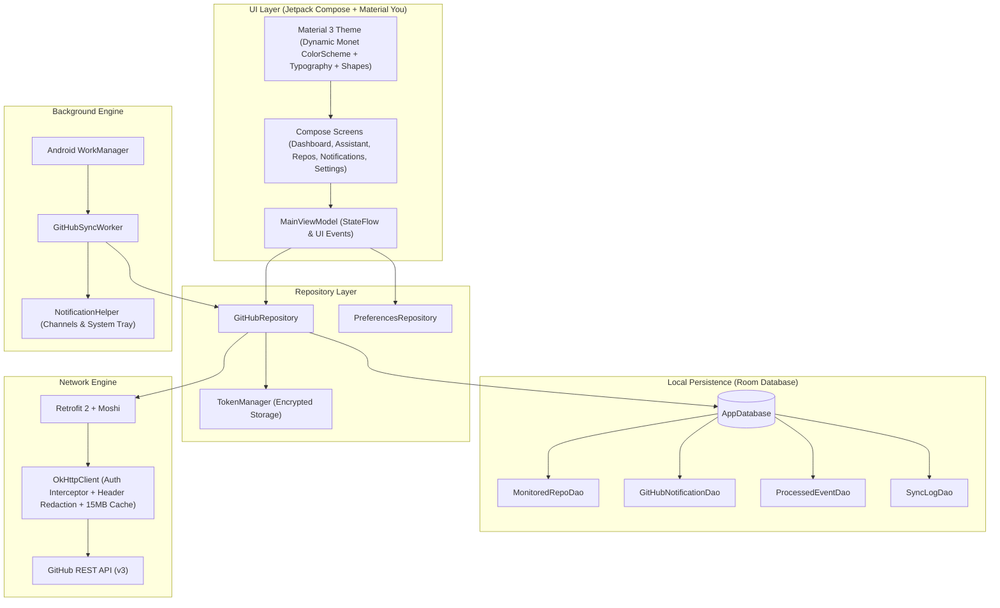

# MadoGit Architecture Specification

> [!IMPORTANT]
> **Project Status: Experimental**
> MadoGit is currently under active, experimental development. Architecture components and schema models are subject to iterative refinements.

## Overview

MadoGit is built as an offline-first, reactive Android application utilizing modern Android architecture components, Jetpack Compose, Material You (Material 3 Dynamic Color), Room Database, and Android WorkManager.

The application follows the recommended Android architecture guidelines: strict separation of concerns, unidirectional data flow (UDF), repository pattern, and reactive state management powered by Kotlin Coroutines and StateFlow.

---

## Architectural Principles

1. **Strictly On-Device Processing**: No intermediate backend or telemetry server. All requests are dispatched directly from the device to GitHub APIs (`api.github.com`).
2. **Offline-First Resilience**: Every UI screen reads exclusively from local Room entities via reactive queries. Remote network operations populate and update the local database.
3. **Adaptive UI via Material You**: Full support for Android 12+ dynamic color extraction (Monet), paired with curated fallback palettes and manual dynamic color control.
4. **Intelligent Battery & Quota Optimization**: Network queries are throttled, cached using HTTP ETags, and prioritized to preserve GitHub's 5,000 requests-per-hour rate limit.

---

## System Architecture Diagram



---

## Layer Breakdown

### 1. Presentation Layer (UI)

The presentation layer is built entirely in **Jetpack Compose** using declarative UI components adhering to Google's Material 3 Expressive guidelines.

- **MainViewModel**: Centralizes application state management. Exposes immutable `StateFlow` streams (`repositories`, `notifications`, `assistantSummary`, `syncStatus`, `rateLimitInfo`, `preferences`). All user actions trigger asynchronous coroutine jobs that execute within `viewModelScope`.
- **Navigation & Transitions**: Managed via `AppNavigation.kt` utilizing typed destinations (`NavDestination`). Features fluid `AnimatedContent` slide-and-fade page transitions with spring physics, tactile haptic feedback on tab changes, and dynamic unread badges on navigation bar items.
- **Common Gesture Components**:
  - `MadoPullToRefreshBox`: Wraps official Compose Material 3 `PullToRefreshBox` with `PullToRefreshDefaults.Indicator` styled in dynamic primary tones across all primary feeds.
  - `MadoSwipeToDismissItem`: Wraps M3 `SwipeToDismissBox` with directional haptic feedback, dual action colored surfaces (primary for read, error for dismiss), and snackbar undo confirmation.
  - `RateLimitGauge`: Custom progress bar and countdown widget for real-time GitHub API rate-limit monitoring.
  - `LanguageDot`: Colored circle indicator mapping official GitHub programming language colors.
- **Screen Implementations**:
  - `DashboardScreen`: Edge-to-edge profile card with integrated one-tap sync, embedded `RateLimitGauge`, metric cards, and animated chronological activity timeline (`Modifier.animateItem()`).
  - `AssistantScreen`: Priority triage feed displaying items needing direct action (pending reviews, assigned issues, failed CI runs), segmented filter chips (*All*, *Reviews*, *Issues*, *CI Runs*), and celebratory "Inbox Zero" empty state.
  - `RepositoriesScreen`: Searchable list of user and organization repositories with quick filter chips (*All*, *Monitored*, *Private*, *Public*), `LanguageDot` badges, monospace branch tags, and fine-grained monitoring toggles.
  - `NotificationsScreen`: Searchable, filterable event archive with chronological date grouping (*Today*, *Yesterday*, *This Week*, *Earlier*), pull-to-refresh, and swipe-to-dismiss gesture handling.
  - `SettingsScreen`: Channel configuration, sync frequency selection, network constraints, live Monet dynamic palette swatches preview, direct Android system notification channel settings shortcut, and diagnostics.
  - `AuthScreen`: Multi-mode authentication supporting Personal Access Tokens and OAuth flow.
  - `OnboardingScreen`: First-run guidance explaining permission requirements and notification benefits.

### 2. Design System & Theming

The theming engine lives in `com.aipos.madogit.ui.theme`:

- **Theme.kt**: Evaluates system capabilities (`Build.VERSION.SDK_INT >= Build.VERSION_CODES.S`) and user preference (`isDynamicColorEnabled`). Dynamically selects `dynamicDarkColorScheme` / `dynamicLightColorScheme` or falls back to custom dark/light palettes.
- **Color.kt**: Semantic color tokens mapping GitHub brand aesthetics (sapphire blue `#58A6FF`, emerald green `#3FB950`, amethyst purple `#BC8CFF`, crimson red `#F85149`, dark slate `#0D1117`, surface `#161B22`) to Material 3 roles (`primary`, full `surfaceContainerLowest` through `surfaceContainerHighest` elevation spectrum, `outlineVariant`, etc.). Includes `getLanguageColor()` mapping programming languages to their standard color codes.
- **Shape.kt**: Corner rounding specifications adhering to Material 3 Expressive radii (Extra Small = `6.dp`, Small = `10.dp`, Medium = `16.dp`, Large = `22.dp`, Extra Large = `28.dp`).
- **Type.kt**: Clear typographic hierarchy based on Google's Inter font scale, extended with monospace developer tokens (`Typography.code` and `Typography.codeSmall`) for commit hashes, branch tags, and syntax tokens.

### 3. Repository Layer

`GitHubRepository` acts as the single source of truth for all GitHub data:

- Mediates between the remote API (`GitHubApiService`) and the local database (`AppDatabase`).
- Implements the offline-first synchronization algorithm:
  1. Inspects rate-limit availability (Normal, Conservative, Critical) before polling.
  2. Leverages transparent OkHttp disk cache (15 MB) for HTTP 304 conditional revalidation.
  3. Polls monitored repositories in a round-robin schedule (up to 5 per sweep).
  4. Inserts or updates entities in Room within transactional boundaries.
  5. Tracks state transitions (such as PR merges and closures) and delegates to `NotificationHelper` for user alerting.
  6. Establishes a silent baseline on initial sync, suppressing alert floods.
  7. Trims execution metrics in `sync_logs` to 200 rows.

### 4. Persistence Layer (Room)

MadoGit uses Room (schema version 3) with the Kotlin Symbol Processing (KSP) engine:

- **MonitoredRepoEntity** (`monitored_repos`): Tracks repository metadata, primary programming language (`language`), monitoring status (`isMonitored`), last sync timestamp, and open issue/PR counts.
- **GitHubNotificationEntity** (`notifications`): Cached GitHub notification threads including unread status, subject type, repository identifiers, and direct URLs.
- **ProcessedEventEntity** (`processed_events`): Deduplication ledger storing unique event IDs, repository names, and event types to prevent duplicate alerts.
- **SyncLogEntity** (`sync_logs`): Operational audit trail recording sync timestamps, duration, items processed, and rate limits.
- **Non-Destructive Migrations**: Production database upgrades are preserved with structured `Migration` definitions (such as `MIGRATION_2_3`), avoiding data loss.

### 5. Background Engine (WorkManager)

- **WorkManagerScheduler**: Schedules periodic background synchronization using `PeriodicWorkRequestBuilder`. Supports user-configurable intervals (15 min, 30 min, 1 hr, 2 hr, 6 hr, or manual only) with exponential retry backoff.
- **Lifecycle Integration**: `GitHubNotifierApp` observes `TokenManager.authState` directly to automatically register periodic work and trigger an immediate initial sweep upon sign-in, while unregistering background jobs on sign-out.
- **Constraints**: Enforces `NetworkType.CONNECTED` (with optional `UNMETERED` flag) and `RequiresBatteryNotLow` to avoid draining device resources during low battery states.
- **GitHubSyncWorker**: A `CoroutineWorker` that executes synchronization routines in the background, maps outcomes to retry policies with an attempt cap of 3, and generates notifications even if the app process is terminated.

---

## Data Flow Lifecycle

```
[System Trigger / User Tap]
           |
           v
[GitHubSyncWorker / MainViewModel]
           |
           v
   [GitHubRepository]
      |          |
      |          +---> Check Rate Limit & ETag Cache
      |          |
      |          +---> Fetch Network Delta (GitHubApiService)
      |          |
      +--------->+---> Save & Update Local Tables (Room)
                         |
                         +---> Compute Actionable Alerts
                         |        |
                         |        +---> [NotificationHelper] ---> Android Notification Drawer
                         v
               [StateFlow Stream]
                         |
                         v
              [Jetpack Compose UI]
```
