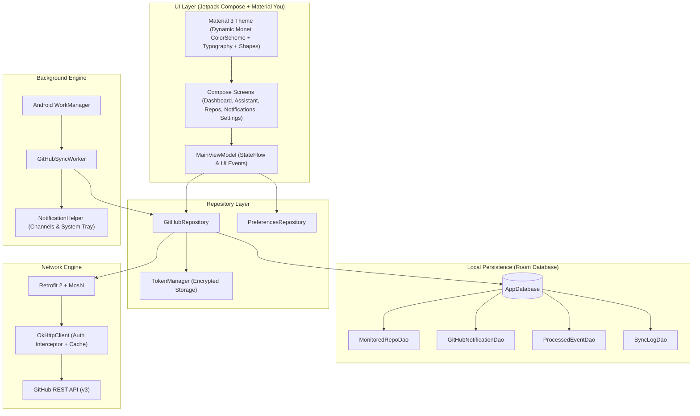

# MadoGit Architecture Specification

> [!IMPORTANT]
> **Project Status: Experimental**
> MadoGit is currently under active, experimental development. Architecture components and schema models are subject to iterative refinements.

## Overview

MadoGit is built as an offline-first, reactive Android application utilizing modern Android architecture components, Jetpack Compose, Material You (Material 3 Dynamic Color), Room Database, and Android WorkManager.

The application follows the recommended Android architecture guidelines: strict separation of concerns, unidirectional data flow (UDF), repository pattern, and reactive state management powered by Kotlin Coroutines and StateFlow.

---

## Architectural Principles

1. **Strictly On-Device Processing**: No intermediate backend or telemetry server. All requests are dispatched directly from the device to GitHub APIs (`api.github.com`).
2. **Offline-First Resilience**: Every UI screen reads exclusively from local Room entities via reactive queries. Remote network operations populate and update the local database.
3. **Adaptive UI via Material You**: Full support for Android 12+ dynamic color extraction (Monet), paired with curated fallback palettes and manual dynamic color control.
4. **Intelligent Battery & Quota Optimization**: Network queries are throttled, cached using HTTP ETags, and prioritized to preserve GitHub's 5,000 requests-per-hour rate limit.

---

## System Architecture Diagram



---

## Layer Breakdown

### 1. Presentation Layer (UI)

The presentation layer is built entirely in **Jetpack Compose** using declarative UI components adhering to Google's Material 3 design system.

- **MainViewModel**: Centralizes application state management. Exposes immutable `StateFlow` streams (`repositories`, `notifications`, `assistantSummary`, `syncStatus`, `rateLimitInfo`, `preferences`). All user actions trigger asynchronous coroutine jobs that execute within `viewModelScope`.
- **Navigation**: Managed via `AppNavigation.kt` utilizing typed destinations (`NavDestination`). Features responsive bottom navigation on standard displays and adaptive rails for wide-screen or foldable form factors.
- **Components**:
  - `DashboardScreen`: Edge-to-edge profile card with integrated one-tap sync, rate-limit status, activity metrics, and chronological timeline.
  - `AssistantScreen`: Priority triage displaying items needing direct action (pending reviews, assigned issues, failed CI runs).
  - `RepositoriesScreen`: Searchable list of user and organization repositories with fine-grained monitoring toggles.
  - `NotificationsScreen`: Searchable, filterable event archive with edge-to-edge search and category chips.
  - `SettingsScreen`: Channel configuration, sync frequency selection, network constraints, theme customization, and diagnostics.
  - `AuthScreen`: Multi-mode authentication supporting Personal Access Tokens and OAuth flow.
  - `OnboardingScreen`: First-run guidance explaining permission requirements and notification benefits.

### 2. Design System & Theming

The theming engine lives in `com.aipos.madogit.ui.theme`:

- **Theme.kt**: Evaluates system capabilities (`Build.VERSION.SDK_INT >= Build.VERSION_CODES.S`) and user preference (`isDynamicColorEnabled`). Dynamically selects `dynamicDarkColorScheme` / `dynamicLightColorScheme` or falls back to custom dark/light palettes.
- **Color.kt**: Semantic color tokens mapping GitHub brand aesthetics (dark slate background `#0D1117`, surface `#161B22`, border `#30363D`, accent green `#2EA44F`) to Material 3 roles (`primary`, `surfaceContainer`, `outlineVariant`, etc.).
- **Shape.kt**: Corner rounding specifications adhering to Material 3 standard radii (`small = 8.dp`, `medium = 12.dp`, `large = 16.dp`, `extraLarge = 24.dp`).
- **Type.kt**: Clear typographic hierarchy based on Google's Inter font scale.

### 3. Repository Layer

`GitHubRepository` acts as the single source of truth for all GitHub data:

- Mediates between the remote API (`GitHubApiService`) and the local database (`AppDatabase`).
- Implements the offline-first synchronization algorithm:
  1. Inspects rate-limit availability before executing network requests.
  2. Dispatches conditional GET requests with ETag support.
  3. Inserts or updates entities in Room within transactional boundaries.
  4. Detects novel items and delegates to `NotificationHelper` for user alerting.
  5. Records execution metrics into `sync_logs`.

### 4. Persistence Layer (Room)

MadoGit uses Room with the Kotlin Symbol Processing (KSP) engine:

- **MonitoredRepoEntity** (`monitored_repositories`): Tracks repository metadata, monitoring status (`isMonitored`), last sync timestamp, and open issue/PR counts.
- **GitHubNotificationEntity** (`notifications`): Cached GitHub notification threads including unread status, subject type, repository identifiers, and direct URLs.
- **ProcessedEventEntity** (`processed_events`): Deduplication ledger storing composite SHA-256 hashes of event IDs and timestamps to prevent duplicate alerts.
- **SyncLogEntity** (`sync_logs`): Operational audit trail recording sync timestamps, duration, items processed, and rate limits.

### 5. Background Engine (WorkManager)

- **WorkManagerScheduler**: Schedules periodic background synchronization using `PeriodicWorkRequestBuilder`. Supports user-configurable intervals (15 min, 30 min, 1 hr, 2 hr, 6 hr).
- **Constraints**: Enforces `NetworkType.CONNECTED` (with optional `UNMETERED` flag) and `RequiresBatteryNotLow` to avoid draining device resources during low battery states.
- **GitHubSyncWorker**: A `CoroutineWorker` that executes synchronization routines in the background, detects actionable alerts, and generates notifications even if the app process is terminated.

---

## Data Flow Lifecycle

```
[System Trigger / User Tap]
           |
           v
[GitHubSyncWorker / MainViewModel]
           |
           v
   [GitHubRepository]
      |          |
      |          +---> Check Rate Limit & ETag Cache
      |          |
      |          +---> Fetch Network Delta (GitHubApiService)
      |          |
      +--------->+---> Save & Update Local Tables (Room)
                         |
                         +---> Compute Actionable Alerts
                         |        |
                         |        +---> [NotificationHelper] ---> Android Notification Drawer
                         v
               [StateFlow Stream]
                         |
                         v
              [Jetpack Compose UI]
```
