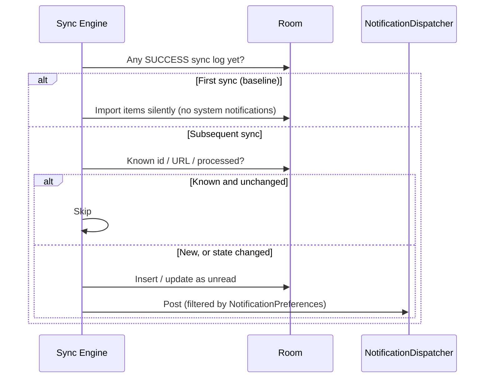

# MadoGit Synchronization Engine & Rate Limiting Strategy

## Overview

The GitHub REST API enforces strict hourly rate limits on all authenticated endpoints. For personal access tokens (PAT) and OAuth applications, GitHub limits traffic to **5,000 requests per hour**.

MadoGit implements a multi-tiered synchronization engine engineered to maximize notification timeliness while strictly preventing quota exhaustion.

---

## Rate Limit Preservation Architecture

### 1. Quota Telemetry

At the start of every sweep the engine calls `GET /rate_limit` (which does not count against the core quota) and caches `remaining` / `limit` in `PreferencesRepository`.

This data is exposed via `StateFlow` to the UI through the `RateLimitGauge` composable embedded in both the Dashboard Account Card and Settings Diagnostics section.

### 2. Adaptive Safety Threshold

Before initiating any synchronization cycle, the synchronization engine evaluates the remaining quota (`GitHubRepository.RATE_*_THRESHOLD`):

| Remaining Quota | Sync Engine Behavior |
|---|---|
| ≥ 500 requests | Full sweep: `/notifications` plus, for each polled repo, workflow runs, pull requests, issues and releases. |
| 100 – 499 requests | Conservative mode: `/notifications` plus pull requests only. Workflow, issue and release polling is skipped. |
| < 100 requests | Quota protection mode: only `/notifications` is checked. A notice is shown via the app snackbar. |

### 3. Bounded Per-Sweep Cost

- **Round-robin polling**: at most 5 monitored repositories are polled per sweep, least-recently-synced first, so cost is constant regardless of how many repos are monitored.
- **Repository list refresh**: the user's repository list (paginated, up to 10 × 100) is refreshed at most every 12 hours. Repositories no longer accessible are pruned only when the full listing was retrieved.
- **Single flight**: overlapping sync requests (worker + pull-to-refresh) are coalesced by a mutex; the second caller returns immediately.

---

## HTTP Caching

Conditional requests are delegated to OkHttp's disk `Cache` (`ApiClient.initCache`, 15 MB). OkHttp stores `ETag` / `Last-Modified` validators and revalidates automatically, so unchanged responses come back as `304 Not Modified` without app-level bookkeeping.

---

## Event Deduplication & Delivery

### Stable identifiers

Every stored item has a deterministic id derived from GitHub's own ids: `gh_thread_<id>`, `gh_run_<id>`, `gh_pr_<id>`, `gh_issue_<id>`, `gh_release_<id>`. Repository-polled events are additionally recorded in `processed_events`, so items the user deletes are never re-imported.

### Delivery rules

- **Baseline**: the very first sync (and the first poll of a newly monitored repo) imports existing items as already-seen, avoiding a notification flood.
- **Thread resurfacing**: a GitHub notification thread that is unread again with a newer `updated_at` is marked unread locally and re-announced.
- **Read on GitHub**: threads read elsewhere are marked read locally and their system notification is dismissed.
- **Pull request transitions**: PRs are polled in all states (most recently updated first). A PR previously stored as open is updated in place and re-announced when it is merged or closed, honouring the *PR merged* / *PR closed* preferences.
- **Workflow runs**: failed (incl. `timed_out`, `startup_failure`), succeeded and cancelled runs are recorded according to the GitHub Actions preferences.

Sync logs are trimmed to the most recent 200 entries.

---

## Background Synchronization & Android OS Constraints

### WorkManager Lifecycle

Background polling is managed exclusively through Google's `WorkManager` library (`GitHubSyncWorker`):

- **Minimum Periodic Interval**: Android OS strictly enforces a minimum periodic interval of **15 minutes**. Configurations requesting sub-15-minute executions are clamped by the OS scheduler to 15 minutes.
- **Battery Optimization (Doze Mode)**: When the device enters Doze mode (stationary, unplugged, screen off), the OS batches WorkManager jobs into periodic maintenance windows. MadoGit respects Doze constraints without requesting non-standard battery bypass permissions.
- **Constraints**:
  - `NetworkType.CONNECTED`: Sync jobs are deferred when the device has no active network connectivity.
  - `RequiresBatteryNotLow`: Prevents background polling when the device drops into low battery state.
  - `RequiresUnmeteredNetwork` (Optional): User-configurable in Settings to restrict heavy background synchronization to Wi-Fi networks only.

---

### Scheduling

- Periodic work is scheduled when the user signs in and cancelled when they sign out (`GitHubNotifierApp` observes `TokenManager.authState`). An immediate sync runs on sign-in.
- Opening the app triggers a sync if the last one is older than 5 minutes.
- Interval "Manual Only" cancels periodic work entirely.

---

## Error Handling & Backoff Strategy

`GitHubSyncWorker.resultFor()` maps each sweep outcome to a WorkManager result:

| Outcome | Worker result |
|---|---|
| Success | `success()` |
| Offline / transient error (5xx, timeout) | `retry()` with WorkManager exponential backoff starting at 30 s, up to 3 attempts, then `failure()` until the next period |
| 401 Unauthorized (token revoked) | Token is cleared, auth state set to error, `failure()` (never retried) |
