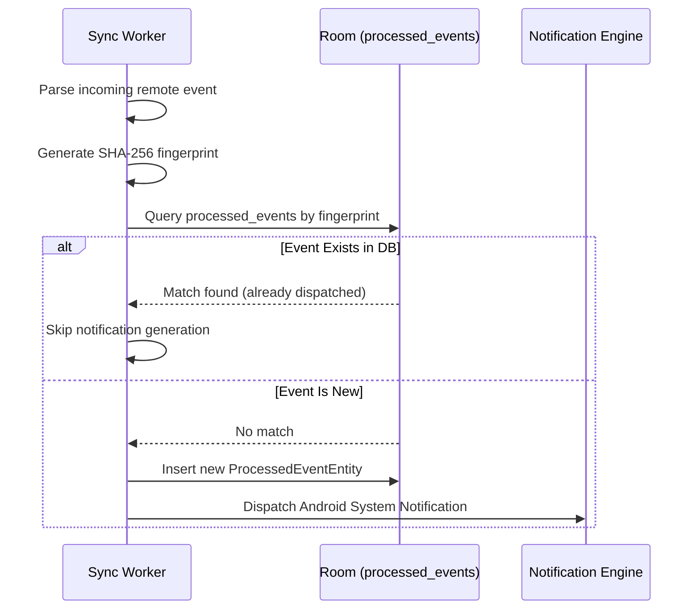

# MadoGit Synchronization Engine & Rate Limiting Strategy

## Overview

The GitHub REST API enforces strict hourly rate limits on all authenticated endpoints. For personal access tokens (PAT) and OAuth applications, GitHub limits traffic to **5,000 requests per hour**.

MadoGit implements a multi-tiered synchronization engine engineered to maximize notification timeliness while strictly preventing quota exhaustion.

---

## Rate Limit Preservation Architecture

### 1. Header Inspection & Live Telemetry

Every HTTP response received by MadoGit passes through OkHttp network interceptors that parse rate limit telemetry:

- `X-RateLimit-Limit`: Maximum hourly allowance allocated to the authenticated user (typically 5,000).
- `X-RateLimit-Remaining`: Number of requests remaining in the current window.
- `X-RateLimit-Reset`: Unix epoch timestamp indicating when the quota resets.

This data is exposed via `StateFlow` to the UI dashboard as a live gauge and cached in `PreferencesRepository`.

### 2. Adaptive Safety Threshold

Before initiating any synchronization cycle, the synchronization engine evaluates the remaining quota:

| Remaining Quota | Sync Engine Behavior |
|---|---|
| > 500 requests | Full synchronization: fetches unread notifications, review requests, assigned issues, and monitored workflow statuses. |
| 100 - 500 requests | Conservative mode: polls global `/notifications` and active pull requests only. Skips detailed CI workflow run polling. |
| < 100 requests | Quota protection mode: suspends automatic repository sweeps. Emits a localized system status warning. Manual user-triggered syncs remain permitted with confirmation. |

---

## HTTP ETag & Conditional GET Protocol

To minimize bandwidth consumption and avoid burning quota on unmutated data, MadoGit implements standard HTTP Conditional GET operations:

```
Client (MadoGit)                       GitHub REST API
      |                                      |
      |--- GET /notifications -------------->|
      |<-- 200 OK (ETag: "abc123xyz") -------| (Stores ETag in Room)
      |                                      |
      |    [Next Sync Cycle - 15m Later]     |
      |                                      |
      |--- GET /notifications -------------->|
      |    If-None-Match: "abc123xyz"        |
      |                                      |
      |<-- 304 Not Modified -----------------| (Zero body payload transferred)
```

1. Each successful HTTP 200 response saves the `ETag` header alongside the entity in Room.
2. Subsequent requests submit the cached ETag using the `If-None-Match` header.
3. If no new events have occurred, GitHub responds with `304 Not Modified`.
4. The local database remains unchanged, and battery/CPU cycles are conserved.

---

## Event Deduplication & Fingerprint Hashing

When polling endpoints that lack unique server-side event IDs (such as workflow run transitions or comment edits), MadoGit generates deterministic fingerprint hashes.

### Hashing Schema

Each event is converted to a SHA-256 fingerprint:

```
Fingerprint = SHA-256(EventType + ":" + RepositoryId + ":" + EntityId + ":" + UpdatedTimestamp)
```

### Deduplication Pipeline



Events older than 30 days are automatically purged during maintenance sweeps to maintain lightweight database size.

---

## Background Synchronization & Android OS Constraints

### WorkManager Lifecycle

Background polling is managed exclusively through Google's `WorkManager` library (`GitHubSyncWorker`):

- **Minimum Periodic Interval**: Android OS strictly enforces a minimum periodic interval of **15 minutes**. Configurations requesting sub-15-minute executions are clamped by the OS scheduler to 15 minutes.
- **Battery Optimization (Doze Mode)**: When the device enters Doze mode (stationary, unplugged, screen off), the OS batches WorkManager jobs into periodic maintenance windows. MadoGit respects Doze constraints without requesting non-standard battery bypass permissions.
- **Constraints**:
  - `NetworkType.CONNECTED`: Sync jobs are deferred when the device has no active network connectivity.
  - `RequiresBatteryNotLow`: Prevents background polling when the device drops into low battery state.
  - `RequiresUnmeteredNetwork` (Optional): User-configurable in Settings to restrict heavy background synchronization to Wi-Fi networks only.

---

## Error Handling & Backoff Strategy

Network operations employ exponential backoff with jitter to handle intermittent connectivity failures and transient GitHub 502/503 responses:

- Initial backoff: 30 seconds.
- Multiplier: 2.0x per failure.
- Maximum backoff: 10 minutes.
- Retry cap: 3 consecutive attempts per sync cycle.
